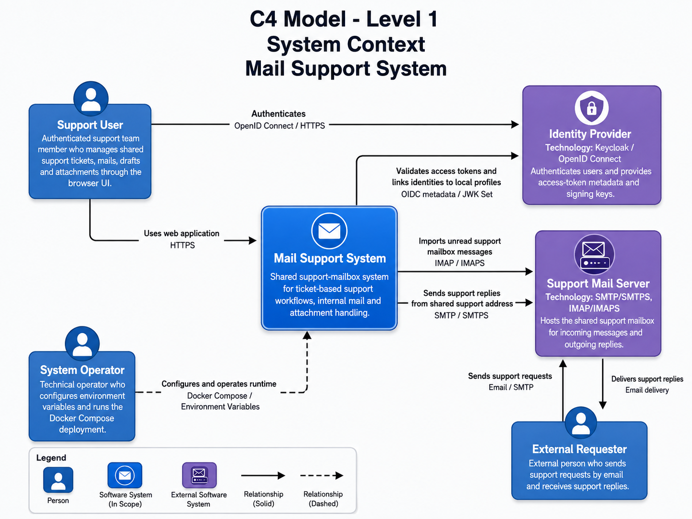
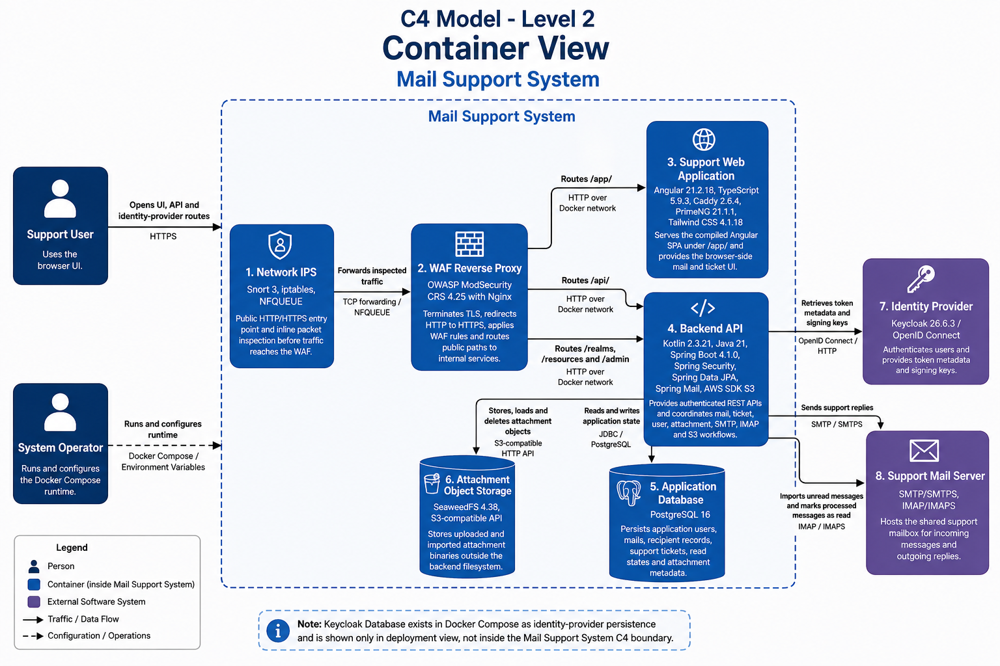
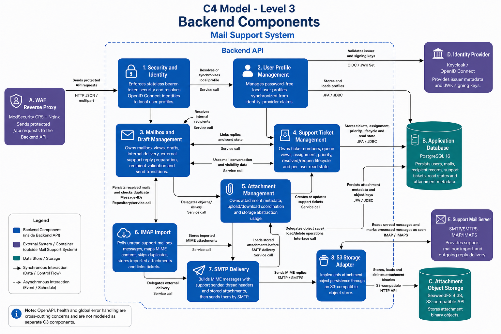

= Mail Support System
:toc:
:toclevels: 3
:sectanchors:
:source-highlighter: rouge

Mail Support System is a full-stack web application for a shared support mailbox with ticket-based mail handling.
Authenticated support users can work on shared incoming support requests, create and send replies through the configured support mailbox, manage drafts and attachments, and use internal application mail where needed.

The repository contains an Angular frontend, a Kotlin/Spring Boot backend, a Caddy static web server, a Snort inline IPS, a ModSecurity/Nginx WAF reverse proxy, PostgreSQL, SeaweedFS/S3-compatible attachment storage and a local Keycloak OpenID Connect setup for Docker Compose based evaluation.

== System Overview

The system is designed as a split frontend/backend application with externalized identity, mail and attachment storage concerns:

* Angular single-page application served by Caddy under `/app/`.
* Snort inline IPS in front of a ModSecurity/Nginx WAF reverse proxy that exposes the public HTTP/HTTPS ports and forwards `/api/*` requests to the backend service.
* Kotlin/Spring Boot REST API for users, mails, tickets, attachments, SMTP sending and IMAP import.
* PostgreSQL application database for users, mails, ticket state and attachment metadata.
* SeaweedFS/S3-compatible object storage for uploaded and imported attachment binaries.
* Keycloak OpenID Connect identity provider for local Docker evaluation.
* SMTP integration for outgoing support replies through the configured support mailbox.
* IMAP polling for importing unread support mailbox messages.

== Features

[cols="1,3",options="header"]
|===
| Area | Behavior

| Authentication
| Keycloak provides OpenID Connect authentication. The Angular client uses Authorization Code Flow with PKCE, while the backend validates signed bearer access tokens as an OAuth2 Resource Server. The application does not store user passwords or expose local registration endpoints.

| Support ticket queues
| Incoming support mails are grouped into persistent support tickets. Users can view open, waiting and resolved queues, assign or unassign tickets, update priority, resolve tickets and reopen resolved tickets.

| Shared support mailbox
| External incoming support mails sent to the configured support address are imported and visible to authenticated support users. External replies are sent through the same configured support mailbox address.

| Ticket tracking
| Replies keep one ticket code in the subject. Incoming follow-up mails with an existing ticket code are associated with the existing ticket, and customer replies can move a resolved ticket back into the active support workflow.

| Mail folders
| Authenticated users can view incoming mails, sent mails and drafts. Imported external support mails and internal application mails are rendered consistently in list and detail views.

| Mail composition
| Users can create drafts, edit drafts, send existing drafts and create-and-send mails in one flow. Each mail uses one explicit delivery mode: `INTERNAL` for existing team profiles or `EXTERNAL` for SMTP delivery through the configured support mailbox.

| Recipients
| Internal mails use existing team profiles as `TO`, `CC`, `BCC` and `REPLY_TO` recipients. External mails use manually entered email addresses for the same recipient categories. The backend rejects mixed internal/external recipient requests and prevents internal self-sending.

| Attachments
| Files can be uploaded, associated with mails, downloaded through the API and removed from object storage when the mail is deleted. The database stores metadata and object keys; binary content is stored in SeaweedFS through the S3 API.

| IMAP import
| Imported messages are stored as `RECEIVED`, keep external sender metadata, persist attachments, skip duplicate `Message-ID` values and are marked as read after successful handling. App-generated SMTP messages are marked with an origin header and ignored during IMAP import.

| Mailbox refresh
| Ticket queues and open ticket conversations refresh through a runtime-configured frontend interval so newly imported support mails become visible without a browser reload. The interval and request timeout are configured through environment variables and bounded by frontend safety limits.

| OpenAPI
| The backend exposes a generated OpenAPI document and Swagger UI through the HTTPS edge gateway under `/api`. Protected operations document JWT bearer authentication.

| Local container runtime
| Docker Compose starts the Snort IPS, ModSecurity/Nginx WAF reverse proxy, frontend/Caddy, backend, PostgreSQL, SeaweedFS, Keycloak and the Keycloak database with persistent Docker volumes for application, object-storage and identity-provider state.
|===

The authentication choice, considered alternatives and implemented OpenID Connect flow are documented in link:docs/architectural-decisions/identity-management.adoc[Identity Management with Keycloak and OpenID Connect].

== Scope

The project implements a mail support workflow around a shared support mailbox. The primary use case is a team of authenticated support users processing external support emails as tickets. Internal application mail remains available as an additional workflow and does not use SMTP.

The Docker Compose setup is intended for local evaluation and development. A public production deployment should provide production-grade secret management, TLS termination, stable public hostnames and operational monitoring.

== Implemented Corrections and Quality Improvements

The current implementation addresses the following functional, architectural and deployment concerns:

[cols="1,3",options="header"]
|===
| Area | Implemented correction

| Authentication
| Local password storage and application-owned login endpoints were removed. Authentication is delegated to Keycloak through OpenID Connect, and the backend validates bearer tokens as a stateless OAuth2 Resource Server.

| Authorization
| Protected API endpoints require authentication. Mail and attachment access is checked against the authenticated user's visibility rules before data or binary content is returned.

| Error handling
| Backend errors are mapped through a central error contract. Authentication failures, invalid requests, oversized uploads, unsupported attachment formats and storage failures return controlled responses instead of framework stack traces.

| API exposure
| In Docker Compose, the backend is not published directly to the host. Browser and API traffic goes through the IPS/WAF edge path and the reverse proxy under `/api`.

| Frontend routing
| The Angular application is served under `/app/`; direct refresh and deep links are handled by the Caddy SPA fallback.

| Support mailbox model
| The mail workflow uses a shared support mailbox for external communication instead of assuming that every application user has a personal SMTP/IMAP account.

| Ticket tracking
| Imported external mails are grouped into support tickets. Replies preserve a single ticket code in the subject, and follow-up mails can be associated with the existing ticket.

| Mail import
| IMAP polling imports unread support mailbox messages, skips already known message IDs, stores imported mails and attachments, and marks successfully handled messages as read.

| Mailbox display refresh
| Ticket queues and open ticket conversations update through a bounded frontend refresh interval. Refresh requests are prevented from overlapping and time out safely if the backend does not respond.

| Attachment storage
| Persistent attachment binaries are stored outside the backend filesystem in SeaweedFS through the S3-compatible API. PostgreSQL stores attachment metadata and object keys.

| Code structure
| Mail sending, reply handling, attachment access, ticket lifecycle, user profile lookup and storage access are separated into dedicated services and interfaces.

| Build and quality checks
| The repository provides Gradle tasks for backend and frontend build orchestration, Kotlin static analysis with detekt, Angular linting with ESLint and automated tests.
|===

== Architecture

The preferred architecture documentation uses a logical C4 model. The Mail Support System boundary contains the application-owned runtime parts. Identity and mailbox systems stay outside the boundary because they are external services used by the application.

The following C4 diagrams describe the system context, runtime containers and backend components of the Mail Support System.

=== C4 Level 1 - System Context

Level 1 shows the Mail Support System as one software system, its user roles and the external systems it depends on.

=== C4 Level 2 - Container View

Level 2 decomposes the Mail Support System into deployable and persistent runtime containers. Keycloak and the support mail server are shown outside the system boundary because they provide identity and mailbox services to the application.

=== C4 Level 3 - Backend Components

Level 3 zooms into the Backend API container and shows the main business-oriented backend components and their relationships to external containers and systems.

The tables below summarize the same architecture in text form for accessible review and quick verification.

=== Logical System Boundary

[cols="1,2,2",options="header"]
|===
| Element | Responsibility | Ownership

| Support Web Application
| Serves the Angular UI under `/app/`, manages browser routes and sends authenticated API calls through `/api`.
| Inside Mail Support System

| Network IPS
| Exposes the public HTTP/HTTPS ports, forwards traffic to the WAF reverse proxy and applies Snort inline packet inspection before traffic reaches the application layer.
| Inside Mail Support System

| WAF Reverse Proxy
| Terminates TLS, redirects HTTP to HTTPS, applies ModSecurity inspection to API traffic and forwards `/app`, `/api` and Keycloak paths to internal services.
| Inside Mail Support System

| Backend API
| Provides REST endpoints, validates bearer tokens, manages users, mails, tickets and attachments, and integrates with SMTP, IMAP and S3-compatible storage.
| Inside Mail Support System

| Application Database
| Persists users, mails, mail records, support tickets, ticket read states and attachment metadata.
| Inside Mail Support System

| Attachment Object Storage
| Stores uploaded and imported attachment binaries through an S3-compatible API.
| Inside Mail Support System

| Identity Provider
| Authenticates users and issues OpenID Connect access tokens.
| External system

| Support Mail Server
| Hosts the shared support mailbox and provides SMTP/IMAP access.
| External system
|===

=== Container View

[cols="1,2,3",options="header"]
|===
| Container | Technology | Interfaces

| Support Web Application
| Angular 21.2.19, TypeScript 5.9.3, PrimeNG 21.1.1, Tailwind CSS 4.1.18, Caddy 2.6.4
| Internal web endpoint for `/app/`; browser redirects to Keycloak through the public edge gateway.

| Network IPS
| Snort 3 with NFQUEUE and iptables
| Public HTTP/HTTPS entry point; forwards inspected traffic to the WAF reverse proxy.

| WAF Reverse Proxy
| OWASP ModSecurity CRS 4.25 with Nginx
| Internal HTTP/HTTPS proxy endpoint; redirects HTTP to HTTPS, applies ModSecurity inspection to `/api/` traffic, forwards `/app/` to Caddy and forwards Keycloak paths to the Keycloak service.

| Backend API
| Kotlin 2.3.21, Java 21, Spring Boot 4.1.0, Spring Security OAuth2 Resource Server, Spring Data JPA, Spring Mail, AWS SDK S3 2.25.60
| HTTP REST API under `/api/*`; JDBC to PostgreSQL; S3-compatible HTTP to SeaweedFS; SMTP/IMAP to the support mail server; OIDC JWK lookup to Keycloak.

| Application Database
| PostgreSQL 16
| Internal PostgreSQL/JDBC endpoint consumed by the Backend API.

| Attachment Object Storage
| SeaweedFS 4.38 with S3-compatible API
| Internal S3-compatible endpoint consumed by the Backend API.

| Identity Provider
| Keycloak 26.6.3 with OpenID Connect
| Browser login, OIDC discovery and JWK Set endpoints.

| Support Mail Server
| SMTP/SMTPS and IMAP/IMAPS provider
| External mail delivery and support mailbox import.
|===

=== Backend Component View

The backend is structured around vertical business responsibilities. DTOs, mappers and repositories belong to the component that owns the corresponding business capability.

[cols="1,3",options="header"]
|===
| Component | Responsibility

| Security and Identity
| Stateless API security, bearer-token validation and mapping the OpenID Connect subject to a local user profile.

| User Profile Management
| Password-free local profile synchronization from OpenID Connect claims, current-profile lookup and team-profile listing for internal recipient selection.

| Mailbox and Draft Management
| Mailbox queries, draft creation/update, send transitions, internal recipient records, recipient validation and support reply preparation.

| Support Ticket Management
| Ticket number semantics, ticket queues, assignment, priority, lifecycle state, per-user read state and conversation mapping.

| Attachment Management
| Attachment metadata, upload/download coordination, deletion and access through the storage abstraction.

| IMAP Import
| Periodic unread-message import from the support mailbox, MIME mapping, duplicate handling, attachment persistence and ticket linking.

| SMTP Delivery
| MIME message creation, shared support sender address, stored attachment loading and outgoing SMTP delivery.

| S3 Storage Adapter
| S3-compatible object storage implementation for uploaded and imported attachment binaries.
|===

== Repository Layout

[source,text]
----
mail-system/
|-- backend/                        Kotlin/Spring Boot backend
|   |-- src/main/kotlin/            application source code
|   |-- src/main/resources/         application configuration and seed data
|   |-- build.gradle.kts            backend build configuration
|   `-- Dockerfile                  backend runtime image
|
|-- frontend/                       Angular frontend served by Caddy
|   |-- src/                        pages, components, services, routes and types
|   |-- public/                     static frontend assets
|   |   `-- runtime-config.js       default browser runtime configuration fallback
|   |-- proxy.conf.json             Angular dev-server proxy for /api to localhost:8080
|   |-- package.json                npm scripts and dependencies
|   |-- build.gradle.kts            Gradle integration for frontend tasks
|   |-- Caddyfile                   production static web server and SPA route fallback
|   |-- docker-entrypoint.sh        creates container runtime configuration from env vars
|   `-- Dockerfile                  frontend build and Caddy image
|
|-- ips/                            Snort inline IPS and packet-forwarding entry point
|-- keycloak/                       local Keycloak Docker image and realm import
|-- proxy/                          ModSecurity/Nginx WAF and reverse proxy
|-- scripts/                        local operational helper scripts
|-- docs/                           supplementary project documentation
|   |-- architectural-decisions/    decisions about dependencies and identity management
|   `-- infrastructure/             C4 architecture diagrams embedded in this README
|-- docker-compose.yml              local container orchestration
|-- build.gradle.kts                root Gradle orchestration
|-- settings.gradle.kts             Gradle module declaration
|-- .env.example                    environment template without real credentials
|-- LICENSE                         project license
`-- README.adoc                     project documentation
----

== Technology Stack

[cols="1,3",options="header"]
|===
| Layer | Technology

| Frontend
| Angular 21.2.19, TypeScript 5.9.3, PrimeNG 21.1.1, PrimeIcons 7.0.0, Tailwind CSS 4.1.18, angular-oauth2-oidc 21.0.3

| Backend
| Kotlin 2.3.21, Java 21, Spring Boot 4.1.0, Spring Security 7.1.0 OAuth2 Resource Server, Spring Data JPA, Spring Validation, SpringDoc OpenAPI 3.0.3, AWS SDK S3 2.25.60

| Identity provider
| Keycloak 26.6.3 with OpenID Connect

| Persistence
| PostgreSQL 16 for Docker Compose, H2 2.4.240 as direct-start fallback

| Attachment storage
| SeaweedFS 4.38 through the S3-compatible API, AWS SDK S3 2.25.60 client in the backend

| Mail
| Spring Boot Mail 4.1.0, JavaMail, Spring Integration Mail 7.1.0, SMTP, IMAP

| Build
| Gradle Kotlin DSL, Gradle wrapper 9.6.1, Node Gradle plugin 7.1.0, Node.js 24.12.0, npm 11.6.2

| Runtime
| Docker Compose, Snort 3, iptables/NFQUEUE, OWASP ModSecurity CRS 4.25 with Nginx, Caddy 2.6.4, Keycloak 26.6.3, Eclipse Temurin Java 21 runtime

| Quality
| detekt 2.0.0-alpha.3 for Kotlin, ESLint 10.3.0 and angular-eslint 21.3.1 for Angular/TypeScript
|===

The fixed-version decision and selected build platform are documented in link:docs/architectural-decisions/dependency-management.adoc[Fixed Build and Dependency Versions].

== Prerequisites

Install the following tools for local operation and development:

* Java 21
* Docker and Docker Compose
* Node.js and npm when working directly in `frontend/`
* A compatible SMTP/IMAP mailbox when testing real mail integration

The Gradle wrapper downloads the configured Gradle version automatically. The Gradle-driven frontend build downloads the configured Node/npm versions through the Node Gradle plugin.
Direct backend and frontend dependencies are pinned to fixed versions in their build manifests. Transitive npm packages are resolved through `frontend/package-lock.json`.

== Build Requirements

[cols="1,2,3",options="header"]
|===
| Target | Required inputs | Command and result

| Production-style container build
| Docker, Docker Compose and a root `.env` created from `.env.example`. The `.env` file must provide database credentials, S3/SeaweedFS credentials, SMTP/IMAP mailbox settings, support-mail address and Keycloak settings.
| `./gradlew startLocal` creates a local TLS certificate when missing, runs `docker compose up -d --build --remove-orphans`, builds the Angular production bundle, builds the backend runtime image, waits for the HTTPS health endpoint and starts the complete container stack behind the IPS/WAF edge path.

| Direct backend development
| Java 21. Optional datasource and mail/storage environment variables can be exported from `.env`; otherwise the backend can use its direct-start fallback configuration for local development.
| `./gradlew :backend:bootRun` starts the Spring Boot API directly on the local development port.

| Direct frontend development
| Node.js and npm when running the Angular development server directly outside Gradle.
| `cd frontend && npm ci && npm run start` starts the Angular development server. Requests to `/api/*` are forwarded through `frontend/proxy.conf.json`.

| Verification build
| Java 21. The Gradle frontend integration downloads the configured Node.js and npm versions automatically.
| `./gradlew lint build` runs backend detekt, frontend ESLint, frontend production build, backend compilation and automated tests.
|===

== Configuration

Docker Compose reads runtime values from a root `.env` file. Create it from the template and replace all placeholder credentials before running the system:

[source,bash]
----
cp .env.example .env
----

Do not commit `.env` or any other file containing real credentials. Only `.env.example` belongs in version control.

Required values for Docker Compose:

[source,env]
----
# Public edge ports exposed by the Snort IPS gateway
HTTP_HOST_PORT=80
HTTPS_HOST_PORT=443

DB_USER=postgres
DB_PASSWORD=replace_with_local_db_password
DB_NAME=mail_system

SERVER_PORT=8080
SPRING_SERVLET_MULTIPART_MAX_FILE_SIZE=10MB
SPRING_SERVLET_MULTIPART_MAX_REQUEST_SIZE=25MB
APP_NAME=mail-system

STORAGE_S3_ENDPOINT=http://seaweedfs:8333
STORAGE_S3_REGION=us-east-1
STORAGE_S3_BUCKET=mail-attachments
STORAGE_S3_ACCESS_KEY=replace_with_s3_access_key
STORAGE_S3_SECRET_KEY=replace_with_s3_secret_key
STORAGE_S3_PATH_STYLE_ACCESS=true
STORAGE_S3_INITIALIZE_BUCKET=true

MAIL_SMTP_HOST=mail.example.org
MAIL_SMTP_PORT=465
MAIL_SMTP_USERNAME=mailbox-user
MAIL_SMTP_PASSWORD=replace_with_mailbox_password
MAIL_SMTP_AUTH=true
MAIL_SMTP_PROTOCOL=smtp
MAIL_SMTP_STARTTLS_ENABLE=false
MAIL_SMTP_SSL_ENABLE=true

MAIL_IMAP_HOST=mail.example.org
MAIL_IMAP_PORT=993
MAIL_IMAP_USERNAME=mailbox-user
MAIL_IMAP_PASSWORD=replace_with_mailbox_password
MAIL_IMAP_PROTOCOL=imaps
MAIL_IMAP_FOLDER=INBOX
MAIL_POLLING_INTERVAL_MS=60000
MAILBOX_REFRESH_INTERVAL_MS=15000
MAILBOX_REFRESH_TIMEOUT_MS=10000
SUPPORT_MAIL_ADDRESS=support@example.org

KEYCLOAK_ADMIN_USERNAME=admin
KEYCLOAK_ADMIN_PASSWORD=replace_with_keycloak_admin_password
KEYCLOAK_ISSUER_URI=https://localhost/realms/mail-support
KEYCLOAK_JWK_SET_URI=http://keycloak:8080/realms/mail-support/protocol/openid-connect/certs
KEYCLOAK_DB_NAME=keycloak
KEYCLOAK_DB_USER=keycloak
KEYCLOAK_DB_PASSWORD=replace_with_keycloak_db_password
----

For direct backend development without Docker, the backend starts with H2 defaults unless Spring datasource variables are exported explicitly:

[source,env]
----
SPRING_DATASOURCE_URL=jdbc:postgresql://localhost:5432/mail_system
SPRING_DATASOURCE_USERNAME=postgres
SPRING_DATASOURCE_PASSWORD=replace_with_local_db_password
SPRING_DATASOURCE_DRIVER_CLASS_NAME=org.postgresql.Driver
SPRING_JPA_HIBERNATE_DDL_AUTO=update
----

== Run With Docker

After `.env` has been created and filled with the required runtime values, build and start the complete stack with one Gradle command:

[source,bash]
----
./gradlew startLocal
----

The Gradle task invokes `scripts/start-local.sh`, creates the local self-signed proxy certificate when it is missing, starts Docker Compose in detached mode and waits until the HTTPS health endpoint is reachable. This keeps generated certificate files and private keys out of version control and gives a clear success or failure result.

If the local certificate already exists, the same command reuses it. To start Compose manually, run:

[source,bash]
----
docker compose up -d --build --remove-orphans
----

To inspect the running containers after `startLocal`, stream the logs with:

[source,bash]
----
./gradlew logsLocal
----

Open the application at:

* Frontend through the HTTPS edge gateway: https://localhost/app/
* Backend API through the HTTPS edge gateway only: https://localhost/api
* Generated OpenAPI document: https://localhost/api/v3/api-docs
* Swagger UI: https://localhost/api/swagger-ui
* Keycloak administration: https://localhost/admin/

HTTP on `http://localhost` redirects to HTTPS. Browsers may show a warning for the local self-signed certificate.

The backend service is not published directly to the host in Docker Compose. Browser/API access should go through the edge gateway under `/api`.

Stop the system:

[source,bash]
----
./gradlew stopLocal
----

Remove containers and persisted Docker volumes:

[source,bash]
----
./gradlew resetLocal
----

== Security Architecture

The Docker Compose setup implements the required security layers for local evaluation:

[cols="1,3",options="header"]
|===
| Requirement | Implementation

| Container hardening
| Services drop Linux capabilities by default and run with `no-new-privileges`. Containers that support it use a read-only root filesystem and writable `tmpfs` mounts for runtime directories. The IPS service receives only the additional capabilities required for packet forwarding, iptables and Snort NFQUEUE processing.

| Network separation
| Compose uses dedicated networks between the IPS and WAF, WAF and frontend, WAF and backend, WAF and Keycloak, backend and PostgreSQL, backend and SeaweedFS, backend and Keycloak, and Keycloak and its database. Internal application networks are marked as Docker-internal where external access is not required.

| Reverse proxy WAF
| All browser traffic enters through the Snort IPS and then the ModSecurity/Nginx reverse proxy. API traffic under `/api/` is inspected by ModSecurity before it reaches the backend. The backend, frontend, databases, Keycloak and SeaweedFS are not published directly to the host.

| TLS
| The WAF reverse proxy uses certificate files mounted as Docker secrets from `proxy/cert/`. HTTP requests are redirected to HTTPS. The local start script creates a self-signed certificate automatically when it is missing.

| NIPS
| The `ips` service runs Snort in inline IPS mode with NFQUEUE. It applies Snort community rules and local rules on the edge network path before traffic reaches the WAF. Payload-based HTTP rules apply to unencrypted HTTP traffic; HTTPS payload inspection is handled by ModSecurity after TLS termination.
|===

Snort runs in front of TLS termination and protects the lower network path before the WAF. ModSecurity inspects decrypted API HTTP traffic at the application layer after TLS termination.

== Run For Development

=== Backend

Start the backend from the repository root with the Gradle wrapper. If mail credentials are stored in `.env`, export them before starting the process:

[source,bash]
----
set -a
source .env
set +a
./gradlew :backend:bootRun
----

The backend listens on http://localhost:8080 during direct local development.

=== Frontend

Start the Angular development server from the frontend module:

[source,bash]
----
cd frontend
npm ci
npm run start
----

The frontend development server listens on http://localhost:4200. It uses `frontend/proxy.conf.json` so browser requests to `/api/*` are forwarded to the backend on http://localhost:8080. This mirrors the Docker setup, where the edge gateway forwards `/api/*` to the backend.

If the backend URL changes for direct development, update `frontend/proxy.conf.json` and restart `npm run start`.

== Build And Checks

Build the complete project:

[source,bash]
----
./gradlew build
----

Create installable distributions:

[source,bash]
----
./gradlew installDist
----

The generated runtime artifacts are self-contained for their container runtime use:

[cols="1,2,3",options="header"]
|===
| Artifact | Location | Contents

| Backend distribution
| `backend/build/install/backend/` and `build/install/mail-system/backend/`
| Application start scripts under `bin/` plus all runtime dependency JARs under `lib/`. The backend container copies this distribution into `/app` and runs `/app/bin/backend` on a Java 21 runtime image.

| Frontend distribution
| `frontend/build/angular/browser/`, `frontend/build/install/frontend/` and `build/install/mail-system/frontend/`
| Compiled Angular HTML, JavaScript, CSS and static assets. The frontend container copies the browser bundle into Caddy's `/srv` webroot and creates `/config/runtime-config.js` from environment variables at startup; no Angular development server or `node_modules` directory is required at runtime.

| Container images
| Built by `docker compose build` or through `./gradlew startLocal`
| Multi-stage Docker builds create runtime images from the generated backend and frontend artifacts, while PostgreSQL, SeaweedFS, Keycloak, WAF and IPS dependencies are provided as Compose services.
|===

Run the configured checks:

[source,bash]
----
./gradlew check
----

Run the combined static-code-quality task:

[source,bash]
----
./gradlew lint
----

The lint setup is configured for both application layers:

[cols="1,2,2,2",options="header"]
|===
| Layer | Tooling | Configuration | Command

| Backend
| detekt 2.0.0-alpha.3
| `backend/build.gradle.kts`
| `./gradlew :backend:detekt`

| Frontend
| ESLint 10.3.0 with angular-eslint 21.3.1
| `frontend/eslint.config.js` and `frontend/angular.json`
| `./gradlew :frontend:lintFrontend` or `cd frontend && npm run lint`

| Monorepo
| Root Gradle orchestration
| `build.gradle.kts`
| `./gradlew lint`
|===

Useful module-specific commands:

[source,bash]
----
./gradlew :backend:test
./gradlew :backend:detekt
./gradlew :frontend:build

cd frontend
npm run lint
npm run test -- --watch=false
npm run build
----

== Seed Data

The backend imports local sample profiles from `backend/src/main/resources/data.json` for local evaluation. These records contain no credentials and cannot be used to log in. Authentication identities and credentials belong exclusively to Keycloak.

[cols="1,2,2,3,2",options="header"]
|===
| # | First name | Last name | Username | Initial password

| 1 | Ameline | Allanson | `aallanson@example.com` | `123456`
| 2 | Sanson | Vardey | `svardey1@example.com` | `123456`
| 3 | Jami | Poe | `jpoe@example.uk` | `123456`
| 4 | Trent | Ianno | `tianno3@example.com` | `123456`
| 5 | Alikee | Raisbeck | `araisbeck4@example.com` | `123456`
|===

For local evaluation, `keycloak/realm-mail-support.json` imports matching Keycloak test identities for these sample profiles. The initial password is temporary in Keycloak, so the first login can require setting a new password. Replace evaluation identities and credentials for real deployments.

== Operational Notes

=== Authentication

The login page stays in the Angular application and redirects users to Keycloak only when they start the sign-in flow. The Angular OAuth2/OIDC client performs Authorization Code Flow with PKCE and attaches the access token only to API requests. The Spring Security Resource Server validates the token issuer, lifetime and signature. The standard OpenID Connect `sub` claim links the external identity to a password-free local profile. User credentials and account lifecycle are owned by Keycloak; the application exposes no local login, registration or password-management API.

=== Attachments

Attachments are stored in SeaweedFS through its S3-compatible API. The database stores attachment metadata and the object key used by the backend for download, delete and outgoing SMTP attachment loading. In Docker, SeaweedFS persists objects in the `seaweedfs_data` volume.

=== Mail Sending

Internal mails are delivered inside the application only. They are visible to selected team profiles through the local database and are not sent through SMTP.

External mails are sent through the configured SMTP account. The sender address is controlled by `SUPPORT_MAIL_ADDRESS`, which normally points to the same mailbox used for IMAP polling. Outgoing external messages include `X-Mail-System-Origin: mail-system` so the IMAP importer can identify and ignore copies generated by this application. Replies to imported support mails receive a `[TICKET-000000] Re: ...` style ticket number in the subject when no ticket code exists yet. If the original subject is blank, `Support request` is used as the fallback subject text.

=== Mail Receiving

IMAP polling is enabled in the backend application. The scheduler uses `mail.polling.interval-ms` / `MAIL_POLLING_INTERVAL_MS` and imports unread messages through the same import flow used by operational diagnostics.

Imported messages are persisted as `RECEIVED`, duplicate `Message-ID` values are skipped, attachments are stored through the attachment storage abstraction, app-generated SMTP copies are skipped through the application origin header, and successfully handled messages are marked as read on the IMAP server. Imported support mails are visible to authenticated support users.

The Angular ticket queues and open ticket conversations refresh periodically using `MAILBOX_REFRESH_INTERVAL_MS`. A request timeout configured by `MAILBOX_REFRESH_TIMEOUT_MS` prevents a hanging refresh request from blocking later refresh cycles. The frontend applies minimum and maximum bounds to both values before using them.

Health and IMAP diagnostics are runtime operational endpoints and are intentionally hidden from the generated OpenAPI/Swagger documentation.

=== Load-Balancing Preparation

The backend does not rely on persistent local attachment files. Attachment binaries are externalized to SeaweedFS and application state is stored in PostgreSQL. When running multiple backend replicas against the same support mailbox, operate a single IMAP poller or protect polling with a distributed lock so that one mailbox message is imported once.

== Troubleshooting

=== Docker reports missing environment values

Check that `.env` exists in the repository root and contains all required values listed in `.env.example`.

=== Backend image cannot find `/app/bin/backend`

Rebuild the Docker image from the repository root. The backend Dockerfile runs the Gradle wrapper inside a multi-stage build; no manual local `installDist` step is required:

[source,bash]
----
./gradlew startLocal
----

=== `startLocal` waits during startup

`startLocal` starts the containers in the background and then waits until `https://localhost/api/health` is reachable through the IPS/WAF path. Temporary `502 Bad Gateway` entries during this phase mean the proxy received a request before the backend accepted traffic. They are only a startup problem if the health wait times out.

=== Frontend cannot reach the API during development

For Docker, access the application through https://localhost/app/ so the edge gateway can forward `/api/*` to the backend. For separate development servers, make sure the backend is reachable on http://localhost:8080 and restart `npm run start` so Angular loads `proxy.conf.json`.

=== Login fails after deleting Docker volumes

Deleting Docker volumes removes application and identity-provider state. Restart the full Docker Compose stack, open the frontend through the edge gateway at https://localhost/app/ and start a fresh login through Keycloak.

=== Keycloak or backend reports database authentication errors

PostgreSQL initializes users and passwords only when the corresponding Docker volume is created. If `.env` database credentials are changed while `db_data` or `keycloak_db_data` already exists, the containers can reject the new credentials. Either restore the original credentials in `.env` or reset the local development volumes:

[source,bash]
----
./gradlew resetLocal
./gradlew startLocal
----

=== Database state should be reset

Remove Docker volumes:

[source,bash]
----
./gradlew resetLocal
----

== License

This project is licensed under the link:LICENSE[MIT License].
